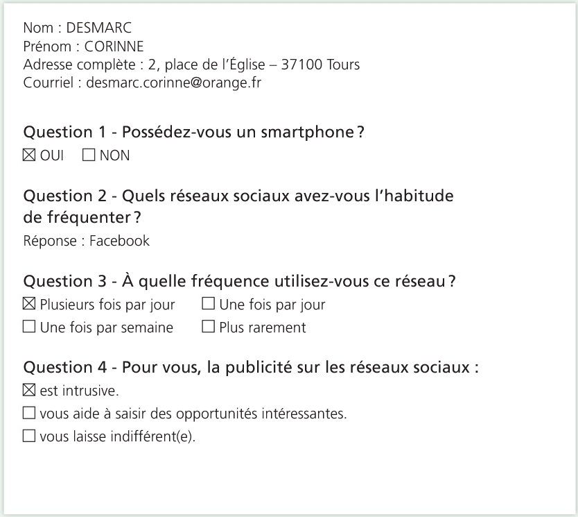
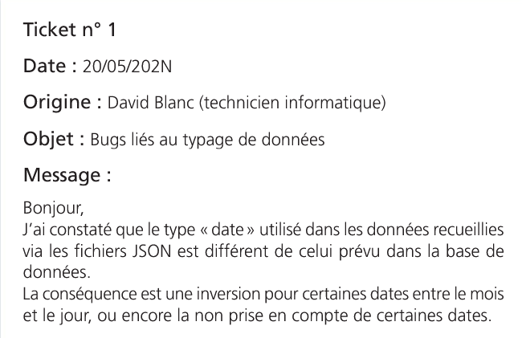
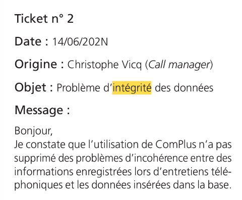

## Documents relatifs à la partie 1

### Document 1 - Extrait des données recueillies lors d'une étude de marché

Un client de KLIENTE souhaite recueillir des données sur les attentes du marché de la publicité relatives aux réseaux sociaux. Voici un extrait du questionnaire :

---

### Document 2 - Tableau de recensement des opérations réalisées pour une étude de marché

| Opération                 | Référence | Finalité          | Catégories de DCP concernées | Catégories de personnes concernées | Destinataires             |
| ------------------------- | --------- | ----------------- | ---------------------------- | ---------------------------------- | ------------------------- |
| Enregistrement d'un appel | OP-01     | Preuve de l'appel | Vie personnelle              | Prospect                           | Client et service interne |
| ...                       | ...       |                   |                              |                                    |                           |

---

### Document 3 - Processus de réalisation d'une étude de marché chez KLIENTE

**Exemple de lecture d'une opération** : la demande d'autorisation d'enregistrement d'un appel précède toujours l'enregistrement de l'acceptation de la personne interrogée et le début de l'entretien.

---

### Document 4 - KLIENTE, un centre d'appel multicanal

L'appreillage des clients et la facilité d'accès à certaines informations via Internet oblige KLIENTE à une transformation digitale. Le client peut établir le contact par courriel, puis par un appel téléphonique pour enfin suivre l'évolution de sa demande sur une app mobile. KLIENTE doit accompagner ce changement en adoptant le multicanal : les plateformes des centres d'appels sont désormais capables de gérer les demandes en provenance de plusieurs canaux (site internet, courriel, SMS, appel vidéo, etc.).

---

### Document 5 - Spécificités techniques de l'application ComPlus

L'application ComPlus a été développée spécifiquement pour KLIENTE. Le rôle de l'application est de collecter et de traiter des données issues du processus d'étude de marché collectées via différents canaux : courriel, SMS, appel téléphonique ou vidéo, formulaire sur le site Internet, app mobile fournie par la société.

ComPlus permet d'éditer des synthèses d'études de marchés pour les clients et de bénéficier de rapports d'activités pour les _call managers_.

La variété des solutions techniques entraîne une utilisation de différents formats de données. Par exemple :

- les données collectées grâce au formulaire du site Internet de KLIENTE peuvent être insérées directement dans la BDD de l'application ComPlus
- les données reçues par courriel, via l'utilisation d'un document au format PDF, sont traitées automatiquement par l'application ComPlus et enregistrées au format CSV avant d'être insérées dans la BDD
- les données collectées via l'application mobile sont transférées au format JSON puis traitées par la solution ComPlus avant une insertion dans la BDD
- d'autres données sont insérées directement dans la BDD par les opérateurs, car la source d'information n'est pas traitable automatiquement par l'application ComPlus (par exemple les enquêtes par téléphone ou visioconférences).

---

### Document 6 - Tickets d'incidents suite à l'utilisation de l'application ComPlus

L'application ComPlus est actuellement testée par quelques opérateurs téléphoniques et les _call managers_. L'objectif est de repérer les incidents et apporter d'éventuels correctifs. Deux tickets d'incidents sont déjà rédigés :

